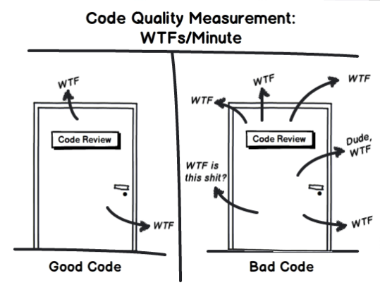

# eslint-plugin-no-array-reduce

[![npm version][npm-badge]][npm-url]
[![npm downloads][downloads-badge]][npm-url]
[![CI][build-badge]][build-url]
[![semantic-release][semantic-badge]][semantic-url]
[![prettier][prettier-badge]][prettier-url]
[![TypeScript][typescript-badge]][typescript-url]

_ESLint rule to disallow `Array.reduce()` method._

Method `reduce()` in most cases can be written as `map()`, `filter()` etc. which benefits in code readability and makes it easier to maintain for future developers.

Subjectively there are still cases where you might want to use `reduce()` with `eslint-disable`.  
There are many debates related to it:

- [Jake Archibald](https://twitter.com/jaffathecake/status/1213077702300852224)
- [Is reduce() bad](https://dev.to/jasterix/is-reduce-bad-2hhd)
- [Write more readable JavaScript](https://betterprogramming.pub/think-again-before-you-use-array-reduce-28f785b5aea9)

[](https://twitter.com/jaffathecake/status/1213084977065279489)

## Install

```bash
npm install --save-dev eslint-plugin-no-array-reduce
```

Then extend eslint config:

```js
{
  "extends": [
    // ...
    "plugin:no-array-reduce/recommended"
  ]
}
```

## Fail

```js
const products = [
  { name: 'milk', type: 'dairy' },
  { name: 'cheese', type: 'dairy' },
  { name: 'beef', type: 'meat' },
  { name: 'chicken', type: 'meat' },
];

// Add price to each product
const productsWithPrices = products.reduce((acc, product) => acc.concat({ ...product, price: 2.7 }), []);
// Filter dairy products
const dairies = products.reduce((acc, product) => (product.type === 'dairy' ? acc.concat(product) : acc), []);
// Group products by type
const productsByType = products.reduce(
  (acc, product) => ({
    ...acc,
    [product.type]: [...(acc[product.type] || []), product],
  }),
  [],
);
```

## Pass

```js
// Add price to each product
const productsWithPrices = products.map((product) => ({ ...product, price: 2.7 }));
// Filter dairy products
const dairies = products.filter((product) => product.type === 'dairy');
// Group products by type (ECMA stage 3 - https://github.com/tc39/proposal-array-grouping)
const productsByType = products.group((product) => product.type);
```

<sub>[CodeSandbox](https://codesandbox.io/s/eslint-plugin-no-array-reduce-4cyc1i?file=/index.js)</sub>

## Contributing

All contributions are welcome!

[npm-url]: https://www.npmjs.com/package/eslint-plugin-no-array-reduce
[npm-badge]: https://img.shields.io/npm/v/eslint-plugin-no-array-reduce.svg
[downloads-badge]: https://img.shields.io/npm/dm/eslint-plugin-no-array-reduce.svg?color=blue
[build-badge]: https://github.com/mkosir/eslint-plugin-no-array-reduce/actions/workflows/main.yml/badge.svg
[build-url]: https://github.com/mkosir/eslint-plugin-no-array-reduce/actions/workflows/main.yml
[semantic-badge]: https://img.shields.io/badge/%20%20%F0%9F%93%A6%F0%9F%9A%80-semantic--release-e10079.svg
[semantic-url]: https://github.com/semantic-release/semantic-release
[prettier-badge]: https://img.shields.io/badge/code_style-prettier-ff69b4.svg
[prettier-url]: https://github.com/prettier/prettier
[typescript-badge]: https://badges.frapsoft.com/typescript/code/typescript.svg?v=101
[typescript-url]: https://github.com/microsoft/TypeScript
