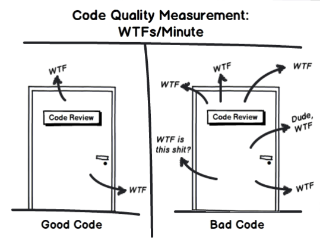

# eslint-plugin-no-array-reduce

[![npm version][npm-badge]][npm-url]
[![CI][build-badge]][build-url]
[![semantic-release][semantic-badge]][semantic-url]
[![TypeScript][typescript-badge]][typescript-url]

_ESLint rule to disallow `Array.reduce()` method._

Methos `reduce()` in most cases can be written as `map()`, `filter()` or one of the `for()` loops which benefits in code readability and makes it easier to maintain for future developers.  
There are many debates, discussions and other resources related to it:

- [Jake Archibald](https://twitter.com/jaffathecake/status/1213077702300852224)
- [Is reduce() bad](https://dev.to/jasterix/is-reduce-bad-2hhd)
- [Write more readable JavaScript](https://betterprogramming.pub/think-again-before-you-use-array-reduce-28f785b5aea9)



## Install

```bash
npm install --save-dev eslint-plugin-no-array-reduce
```

Then extend eslint config:

```js
{
  "extends": [
    // ...
    "plugin:no-array-reduce/recommended"
  ]
}
```

## Fail

```js
const groceries = [
  { name: 'milk', type: 'dairy' },
  { name: 'cheese', type: 'dairy' },
  { name: 'beef', type: 'meat' },
];

// Filter dairy products
const dairy = groceries.reduce((acc, grocery) => (grocery.type === 'dairy' ? acc.concat(grocery) : acc), []);
```

## Pass

```js
// Filter dairy products
const dairy = groceries.filter((grocery) => grocery.type === 'dairy');
```

Subjectively there are cases where you still might want to use `reduce()` with `eslint-disable`.

## Contributing

All contributions are welcome!

[npm-url]: https://www.npmjs.com/package/eslint-plugin-no-array-reduce
[npm-badge]: https://img.shields.io/npm/v/eslint-plugin-no-array-reduce.svg
[build-badge]: https://github.com/mkosir/eslint-plugin-no-array-reduce/actions/workflows/main.yml/badge.svg
[build-url]: https://github.com/mkosir/eslint-plugin-no-array-reduce/actions/workflows/main.yml
[semantic-badge]: https://img.shields.io/badge/%20%20%F0%9F%93%A6%F0%9F%9A%80-semantic--release-e10079.svg
[semantic-url]: https://github.com/semantic-release/semantic-release
[typescript-badge]: https://badges.frapsoft.com/typescript/code/typescript.svg?v=101
[typescript-url]: https://github.com/microsoft/TypeScript
